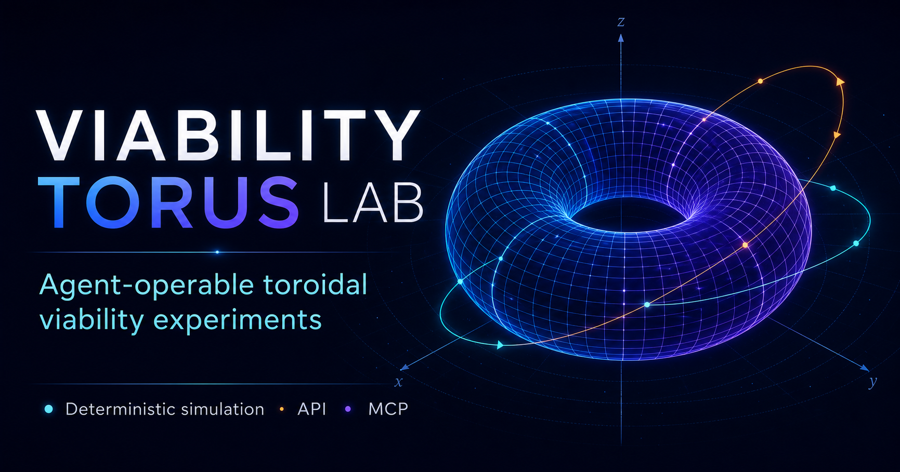

# Viability Torus Lab

[](https://viability-torus-lab.citizen-of-earth.chatgpt.site)

Viability Torus Lab is an interactive ATS/AANA/AIx simulation environment. It maps a fast local correction phase and a slower external adaptation phase onto a torus, then uses radial excursion, correction capacity, divergence pressure, alignment debt, and irreversible loss to explain whether a system stays viable, drifts, recovers, or ruptures.

## Local development

Requirements: Node.js 22.13 or newer and npm.

```bash
npm install
npm run dev
```

Production checks:

```bash
npm run schemas:generate
npm run typecheck
npm test
npm run lint
npm run build
```

## Agent and programmatic use

The dashboard, CLI, HTTP API, and MCP server all call the same deterministic engine and use contract version `1.0.0`.

Run a checked-in experiment:

```bash
npm run experiment -- --config experiments/deployment-stress.json
npm run sweep -- --config experiments/deployment-sweep.json
npm run vtl -- compare --config experiments/deployment-comparison.json
```

Read JSON from stdin by passing `--config -`, or add `--out result.json` for a file. Use `npm run vtl -- help` for all commands.

Start the local stdio MCP server:

```bash
npm run mcp
```

The checked-in `.codex/config.toml` registers that server for trusted Codex workspaces. The public deployment also exposes a stateless Streamable HTTP MCP endpoint at `/mcp`.

Public discovery and data contracts:

- `/.well-known/viability-torus-lab.json` - service description
- `/llms.txt` - concise agent instructions
- `/api/v1/model` - versions, capabilities, bounds, and endpoints
- `/api/v1/scenarios` - published scenario registry
- `POST /api/v1/simulate` - single-seed or ensemble execution
- `POST /api/v1/compare` - paired experiment comparison
- `POST /api/v1/sweep` - bounded parameter search
- `POST /api/v1/proposals/validate` - draft-only scenario evidence validation
- `/schemas/v1/index.json` - JSON Schema catalog

See `docs/AGENT_INTERFACES.md` for request examples, limits, errors, and MCP tools.

## Product areas

- Live scenario simulator with 3D and accessible 2D torus views
- Six structured scenarios with domain-specific parameter labels and presets
- Deterministic seeded simulation, playback controls, interventions, and explanations
- Unwrapped phase, time-series, and radial-stability charts with table alternatives
- Side-by-side compare mode and difference summaries
- Template-based custom-system builder
- Guided learning modules and full theory/paper section
- JSON, CSV, share-link, chart, and torus export tools
- Version-controlled scenario registry for administrative maintenance
- Versioned JSON Schemas, CLI, HTTP API, and MCP tools for agent experiments
- Draft-only scenario proposal validation with human publication gates

## Repository map

- `app/` - responsive product shell and application views
- `components/simulation/` - interactive torus renderer and camera controls
- `components/charts/` - linked scientific canvas charts
- `engine/` - equations, seeded simulation, status classification, summaries
- `contracts/` - versioned validation, limits, experiment operations, and metadata
- `scenarios/` - structured domain definitions and parameter mappings
- `mcp/` - shared MCP tool server used by local stdio and public HTTP transports
- `scripts/` - CLI, MCP entry point, and schema generation
- `experiments/` - reproducible reference experiment specifications
- `proposals/` - un-published scenario drafts and evidence
- `tests/` - deterministic unit and scientific reference cases
- `docs/` - architecture, extension, accessibility, and operating notes

## Scientific scope

The simulator demonstrates synthetic model behavior. It is not empirical evidence that any specific hospital, company, person, ecosystem, or AI system follows a toroidal manifold. The model is conditional on two meaningful recurrent phases. When recurrence is weak or unidentifiable, phase should be reported as undefined.

The full paper is served at `/paper.pdf` and cited in the About the Theory view.
